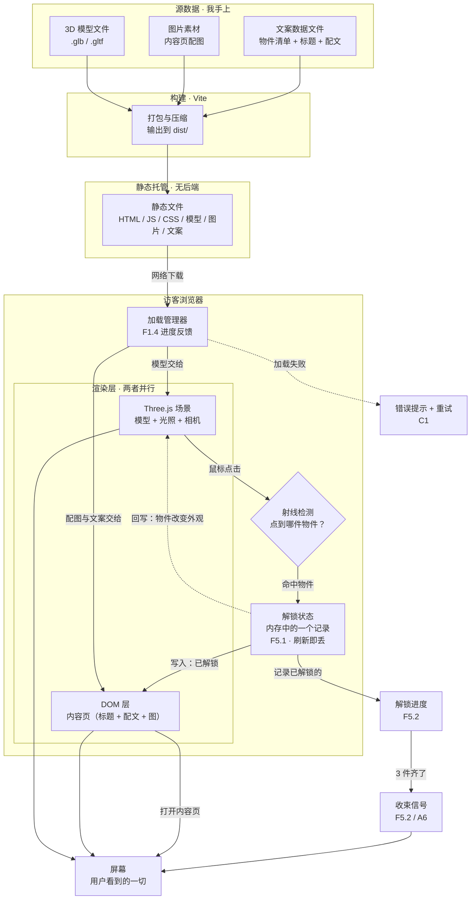

# 技术设计文档 · 3D 探索房间

> **项目工作名**：3D 探索房间（正式名待定）
> **作者**：uni-pf ｜ **仓库**：vibe-coding-project
> **版本**：v1.0 ｜ **日期**：Day 5 · 第 1 周
> **上游文档**：`PRD.md`（Day 4）→ `research.md`（Day 3）
> **下游文档**：原型设计 → 开发（Day 6 起）

---

## 0. 一句话说明数据从哪来、到哪去

**数据从哪来**：全部来自我手上的三份源数据——3D 模型文件、内容页配图、文案数据文件。
**数据到哪去**：经 Vite 打包成静态文件托管，被访客浏览器下载后分两路同时渲染到屏幕——Three.js 画 3D 房间，DOM 层显示内容页。

**整条链上没有服务器参与：纯静态、无后端、无数据库。** 图为 §3。

---

## 1. 技术分工：这个项目有几个部分

### 1.1 结论

**只做前端一层。没有后端，没有数据库。**

```
访客浏览器
   └── 静态文件（HTML / CSS / JS / 3D 模型 / 图片 / 文案）
         └── 全部从静态托管直接下发
```

### 1.2 判断依据（四个问题）

| 判断问题 | 本项目情况 | 结论 |
| --- | --- | --- |
| 要把数据存到服务器上，换设备还能看到吗？ | PRD F5.1 要求「解锁进度当前会话内有效即可」，C3 明确「刷新后回到初始态」可接受 | ❌ 不需要 |
| 有用户注册登录、需要区分身份吗？ | 没有登录，所有访客看到同一间房间 | ❌ 不需要 |
| 有不能公开的秘密吗？ | 无密钥、无付费接口，素材自制或免费授权 | ❌ 不需要 |
| 要防止别人篡改数据吗？ | 所有人拿到同一份固定内容，改也只是本地显示异常 | ❌ 不需要 |

### 1.3 逐条比对 PRD 验收标准

把 PRD 第 5 章全部验收标准过一遍，只挑可能「非后端不可」的候选：

| 标准 | 原文要求 | 前端能否独立满足 |
| --- | --- | --- |
| C1 | 加载失败显示错误提示与重试入口 | ✅ 加载失败在浏览器端即可感知（超时 / 404），提示与重试均为前端行为 |
| C2 | 内容页反复进出，进度不重置 | ✅ 进度存浏览器内存，「反复进出」不涉及刷新 |
| C3 | 刷新后回到可用初始态 | ✅ 这正是**没有**持久化时的自然表现；要「刷新不丢」反而才需要额外手段 |
| E2 | 物件与内容对应关系以数据配置形式存在 | ✅ 指**前端数据文件**，不是数据库表 |

**没有一条卡在后端上。** 本项目为纯静态。

### 1.4 这个决定的代价与好处（补 PRD §6.1 的 H1）

PRD §6.1 的 H1 是「纯静态部署（无后端）足以满足全部需求」——本节把这条**假设坐实为结论**。

| 好处 | 代价 |
| --- | --- |
| 部署＝上传文件，无服务器运维、无服务费 | 解锁进度无法跨设备，刷新即丢 |
| 无网络请求的后端环节，故障面小 | 内容改动需重新发布，不能后台编辑 |
| 性能变量只有静态文件体积与渲染效率——正是 B1「3 秒内可交互」要卡的地方 | 将来若要加真实留言 / 账号，必须补后端（PRD §4 已列为不做项） |

### 1.5 术语口径（已确认）

- **E2 说的「数据配置」** = 前端的一个独立数据文件（物件清单数组，每项含物件 ID、位置、对应文案与图片路径），**不是数据库表**。改配置的位置在代码里，不在后台。

---

## 2. 技术路线

### 2.1 主路线（一行）

> **原生 HTML/CSS/JS + Three.js（3D 渲染）+ GSAP（补间动画）+ Vite（开发与打包），纯静态部署，无后端、无数据库、无 UI 框架。**

### 2.2 从 PRD 反推的技术能力清单

| PRD 功能 | 要解决的技术问题 |
| --- | --- |
| F1.1 房间场景、光照 | 3D 渲染 |
| F1.2 鼠标驱动视角平移 | 相机控制 |
| F1.3 尘埃 / 光影动效 | 逐帧动画循环 |
| F1.4 加载进度反馈 | 资源加载管理 |
| F2.3 悬停高亮 | 鼠标拾取 |
| F2.4 点击命中判定 | 射线检测 |
| F3.1–3.3 电影式过渡 | 补间动画 |
| F4.3 内容页视差 | 滚动响应 |
| E1 / E2 数据与逻辑分离 | 数据配置独立成文件 |
| F6.3 视觉风格统一 | 样式方案 |
| F6.2 移动端降级 | 响应式与适配 |

共 11 项。真正需要引入「库」的是 3D 渲染、补间动画两项，其余用浏览器原生能力解决。

### 2.3 逐项选型（含理由与退出条件）

| 能力 | 选型 | 为什么暂时选它 | 什么条件下换掉 |
| --- | --- | --- | --- |
| 3D 渲染 | **Three.js** | 三个参照站（Grand Theater / Leap For Mankind / Bruno Simon）全部用它；文档与示例最厚；它是库不是框架，可按需取用，不必接受整套规则 | 若后续要大量自定义着色器且熟悉 React → 换 React Three Fiber |
| 补间动画 | **GSAP** | 三个参照站均在用；F3 要求过渡参数统一，GSAP timeline 天生适合；免费版功能已够 | 若动画只剩一两处极简过渡 → 改用 CSS transition / Web Animations API |
| 开发与打包 | **Vite** | PRD H4 担心「选型强依赖构建工具则部署方式需调整」——Vite 打包后就是静态文件，**部署方式不变**；开发时保存即刷新，3D 调试体验差别大 | 若要求零构建 → 改 import map + CDN，代价是失去热更新与依赖管理 |
| UI 框架 | **不用**（原生 HTML/CSS/JS） | 全站只有 2 类页面：3D 房间（Three.js 的 canvas，框架管不到内部）+ 内容页（标题配文加一图，原生几十行）；PRD 无复杂状态管理需求 | 若内容页涨到十几个、出现列表与详情路由 → 引入轻量框架（如 Vue，与参照站一致） |
| 内容页视差 | **CSS + 少量 JS** | 见 §2.4 定档 | 若要做「滚动驱动 3D 相机」这类重交互 → 引入 Lenis + GSAP ScrollTrigger |
| 样式 | **CSS 变量** | 沿用 `index.html` 已有 `--brand: #185FA5`；F6.3 要求风格统一，变量改一处全站生效 | 不需要换 |
| 状态记录 | **内存中的一个记录** | F5.1 只要求当前会话有效，刷新丢失可接受（已确认）；最简做法是一个集合存已解锁 ID | 若要刷新不丢 → 换 localStorage（仍是纯前端）；若要跨设备 → 才需要后端 |
| 3D 素材 | **开源模型 / 自行制作** | PRD H3 假设素材可自行制作或使用免费授权资源；具体来源属执行期问题 | 若找不到合适模型 → 用程序化几何体搭简化房间 |
| 文案素材 | **独立 JS / JSON 数据文件** | 对应已确认的 E2 口径（§1.5） | 不需要换 |
| 部署 | **静态托管** | §1 结论：无后端；GitHub 仓库已有，静态托管零成本 | 若某天要加账号或留言 → 必须补后端，届时再评估 |

### 2.4 F4.3 视差定档（PRD 留给本期必须回答的问题）

PRD §4 末尾写明：「滚动视差动效按要求不砍，保留在 F4.3 范围内，实现程度在 Day 5 技术选型中定档」。定档结论：

**内容页做「轻量视差」——文字与图片以不同速率滚动，滚动本身不反向驱动 3D 场景。**

| 档位 | 内容 | 取舍 |
| --- | --- | --- |
| **轻量视差（本次采用）** | 内容页内背景图 / 配文 / 标题三层以不同速率滚动，产生纵深感 | CSS + 极少量 JS 即可；不影响 B2 帧率；工作量小 |
| 重型视差（不做） | 滚动同时反向控制 3D 相机、驱动模型拆解 | 正是 Day 3 被推翻的最初设想，会与 F3 的点击式转场冲突 |

**理由**：Day 3 结论是「3D 负责探索，DOM 负责阅读与视差」。视差留在内容页内，域界清晰；一旦让它反向驱动 3D，就退回了被否定的旧方案。

### 2.5 本次明确延后、不进技术路线的事项

| 事项 | 处理 | 依据 |
| --- | --- | --- |
| 背景音乐的更换 / 暂停 / 音量控制 | **延后，本期不做，不进数据流图** | PRD D6 只保留「可选背景音」；「可选」即非本期必须项 |

### 2.6 这条路线背后的统一逻辑

**全部选「库」不选「框架」，全部选「零服务端」不选「要运维」。** 因为这是单人作品集项目，时间该花在叙事与过渡效果上，不该花在学习框架规则和配置服务器上。

### 2.7 补充说明：为何不用 Vue（回应选型讨论）

三个参照站中的 Grand Theater 与 Leap For Mankind 使用 Vue，但本项目判断**不需要**：

| 维度 | 参照站的情况 | 本项目 |
| --- | --- | --- |
| DOM 界面规模 | 菜单、设置面板、字幕、照片墙、进度 UI、多语言等大量界面 | 仅内容页一类 |
| Vue 能覆盖的部分 | 外围 UI 与状态 | 只有内容页（PRD F4.3 仅要求基础滚动） |
| 3D 部分的实际归属 | Three.js 管 canvas，Vue 管外围——分工不变 | 同左，且 3D 占工作量大头 |

**结论**：Vue 不是让这类项目「变快」的原因，而是外围界面足够多时才值得引入。本项目工作量集中在 3D 侧（F1 / F2 / F3 均为核心），引入框架需额外承担组件写法、跨模块状态传递、canvas 与组件生命周期的对接问题，收益不匹配。

**预留的升级路径**：界面层若将来需要换成 Vue，Three.js 部分可原样迁移——因为它本身就该独立于界面层。

---

## 3. 数据流图

### 3.1 两条数据线

- **线 A · 3D 场景（模型 → 画面）**：单向。用户不改变它，只改变相机怎么看它。
- **线 B · 内容与状态（文案 → 内容页 → 解锁记录）**：**回环**。点击后状态改变，并反向影响 3D 场景中物件的表现。

线 B 的回环是关键技术点：**点击 → 解锁状态改变 → 3D 场景里该物件改变外观**，构成闭环，是 PRD A7「已解锁与未解锁可区分」的技术落点。

### 3.2 数据流图



### 3.3 数据的来源与去向（文字版）

**从哪来**：三份源数据，全部由我提供——3D 模型文件、内容页配图、文案数据文件（对应 §1.5 已确认的 E2 口径，物件清单不写死在逻辑里）。

**到哪去**：经 Vite 打包为静态文件 → 静态托管下发 → 浏览器下载后分两路同时渲染到屏幕：Three.js 用模型画出 3D 房间；DOM 层显示内容页的文字与图。

**中间发生了什么**：用户点击 → 射线检测判断点到哪件物件 → 解锁状态写入浏览器内存 → 该次写入同时触发两件事：打开内容页、让 3D 场景中该物件改变外观（即图中回环虚线）。三件全部解锁后，内存中的进度触发收束信号。

**这条链上没有任何一步需要服务器。** 图中唯一的网络箭头是「静态文件下载」，不存在请求后端或查询数据库的环节。

### 3.4 图上标注 PRD 编号的用途

每个节点后挂 PRD 功能编号（F1.4、F5.1、C1 等），用于编码期反向核对：**图上每个方框都应在代码中找到对应的一小块**；图上没有对应编号的内容，说明 PRD 未要求，不予实现。

---

## 4. 对 PRD 的影响（回填）

| PRD 条目 | 本文件的结论 |
| --- | --- |
| §6.1 H1「纯静态部署足以满足全部需求」 | **假设成立，已坐实为结论**，见 §1 |
| §6.1 H4「技术栈尚未确定，以 Day 5 结论为准」 | 已确定，见 §2.1；因采用 Vite，部署方式仍为静态托管，无需调整 |
| §4「明确保留项」F4.3 视差定档 | **定档为轻量视差**，见 §2.4 |
| §3 可扩展性要求（E1 / E2） | 技术上由 §2.3「文案素材＝独立数据文件」+「状态记录＝内存记录」支撑 |

---

## 5. 已知缺口

| 缺口 | 说明 | 阻塞什么 |
| --- | --- | --- |
| 3D 素材的具体来源 | 选型已定（开源模型 / 自制），但未确定具体模型清单 | F1.1、F2.1 的实现起点 |
| 角色设定稿 | 承接 PRD §1.5 的未完成项 | F4.2 配文撰写、A5 叙事可串通验收 |
| 具体过渡时长与缓动参数 | §2.4 只定档，具体数值属实现期调参 | F3.2、A4 |
